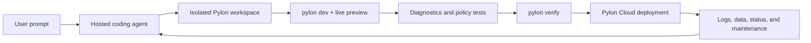

# Pylon Cloud and YC's “Cloud for Small Software” Opportunity

**Date:** July 23, 2026  
**Status:** Strategy overview

## Executive Summary

Y Combinator's Fall 2026 Requests for Startups includes **“A Cloud for Small
Software”**: infrastructure for the growing number of purpose-built applications
that agents can create cheaply but that remain difficult to deploy, secure,
share, and maintain.

This is a strong opportunity for Pylon because most of the expensive foundation
already exists:

- An agent-native, full-stack application model covering schema, policies,
  functions, auth, realtime data, jobs, files, and server-rendered React.
- A single runtime for local development and production.
- A managed Cloud with project provisioning, deploys, previews, domains,
  secrets, databases, logs, metrics, backups, and rollback.
- Agent-facing tooling including the Pylon skill, CLI, diagnostics, policy
  tests, verification, MCP, and one-time Cloud handoff.
- A growing set of templates that gives an agent reliable starting points.

The most direct product extension is a **hosted builder inside Pylon Cloud**:
describe an application, let an agent build it in an isolated Pylon workspace,
interact with a live preview, and publish it through the existing Cloud pipeline.

The builder is not, by itself, the durable advantage. v0 and Replit already
offer natural-language application creation, previews, integrations, and
deployment. Pylon's opportunity is to make the complete loop more reliable and
coherent by constraining generated applications to a runtime the agent and
platform can inspect end to end.

The strategic thesis is:

> **Pylon is the cloud for the millions of small, full-stack applications agents
> will create. The hosted builder is the front door; the integrated,
> self-hostable runtime and operational lifecycle are the moat.**

## The YC Request

YC defines “Small Software” as purpose-built tools used by one person or a small
group: internal workflows, trackers, dashboards, sprint tools, prototypes, and
other bespoke applications. Agents have made these tools much cheaper to write,
but deploying and sharing them still exposes users to infrastructure,
authentication, permissions, customization, and security work.

YC's desired end state is closer to sharing a document than operating a normal
software project. The application may be small, but it still needs a trustworthy
place to run.

Source: [Y Combinator, Fall 2026 Requests for Startups](https://www.ycombinator.com/rfs)

## The Opportunity

### The production gap is becoming the bottleneck

Code generation is rapidly commoditizing. Multiple products can produce a
plausible interface or application from a prompt. The remaining failure modes
are less visible in a demo:

- Authentication exists but does not match the intended access model.
- Authorization is implemented inconsistently across endpoints.
- The application relies on several services with separate configuration,
  credentials, logs, and failure modes.
- Preview behavior differs from production.
- Database migrations are unsafe or difficult to reverse.
- The first version works, but the agent cannot diagnose or maintain it later.
- The application is deployed, but nobody owns its retention, cost, access, or
  lifecycle.

Small applications cannot justify a platform team. Their cloud therefore has to
remove these concerns by construction rather than by documentation.

### Pylon can constrain the problem

A generic hosted builder must support arbitrary languages, frameworks, package
graphs, databases, deployment shapes, and conventions. Pylon can initially
support one well-understood artifact: a Pylon application.

That constraint is useful. A Pylon application declares or exposes:

- Its schema and indexes.
- Row-level policies.
- Server queries, mutations, and actions.
- Routes and frontend assets.
- Authentication and organization behavior.
- Scheduled work.
- Files, search, realtime subscriptions, and other platform capabilities.

The same Pylon runtime executes the application in development and production.
That gives the builder a smaller search space and gives Cloud a machine-readable
view of what the generated application is supposed to do.

## Product Concept

### The hosted builder

The existing agent handoff becomes an in-product experience:

```text
Current flow

Pylon Cloud → generate handoff → open coding agent → scaffold locally
            → create Cloud project → deploy → return to dashboard

Hosted flow

Pylon Cloud → describe app → agent builds → live preview → verify → publish
```

The primary interface is a conversation beside a running application:

```text
┌──────────────────────────────┬──────────────────────────────┐
│ Agent                        │ Live preview                 │
│                              │                              │
│ ✓ Defined the data model     │ inventory-7fa.preview…      │
│ ✓ Added member policies      │                              │
│ ✓ Built the dashboard        │ [running Pylon application] │
│ ● Testing manager actions    │                              │
│                              │                              │
│ Ask for a change…            │                              │
├──────────────────────────────┴──────────────────────────────┤
│ Files · Schema · Policies · Logs · Tests        [Publish]   │
└─────────────────────────────────────────────────────────────┘
```

The user can stay at the level of the product they want. The Pylon-specific
views make the agent's work inspectable without requiring the user to start in a
code editor:

- **Schema:** what the application stores.
- **Policies:** who can read or change each kind of data.
- **Functions:** important server-side operations and external effects.
- **Logs:** runtime and build failures.
- **Tests:** manifest, route, asset, and policy checks.
- **Files:** the exportable source when the user wants it.

### End-to-end builder loop



The critical product property is the closed feedback loop. The agent does not
stop after writing files. It can start the application, inspect the generated
manifest, observe the browser, read diagnostics, test allow and deny cases,
verify routes and assets, deploy, and later inspect the running application.

## Why Pylon Is Well Positioned

### Existing runtime foundation

Pylon already combines the backend and frontend pieces an agent otherwise has
to assemble:

- Typed schema and generated clients.
- SQLite or Postgres.
- Row-level policy evaluation.
- Queries, mutations, and actions.
- Authentication, sessions, organizations, roles, OAuth, OIDC, and SAML.
- Live queries, optimistic mutations, presence, and CRDT-backed collaboration.
- Background jobs and scheduling.
- File storage, email, search, webhooks, billing, and other integrations.
- Native React SSR, routing, images, metadata, and Tailwind.
- React, React Native, and Swift clients.

See [README.md](../README.md), [Pylon Cloud](../apps/docs/cloud.mdx), and
[Organizations](../apps/docs/auth/organizations.mdx).

### Existing agent foundation

Pylon already provides much of the control surface a hosted agent needs:

- The repository-local Pylon skill.
- Agent-oriented project instructions in generated templates.
- `pylon dev` for the local loop.
- `pylon diagnostics` for machine-readable runtime decisions.
- `pylon policy test` for authorization checks.
- `pylon verify` for route, asset, and health verification.
- MCP access to a running application's schema, data, functions, policies, and
  verification.
- Cloud CLI commands for projects, secrets, deploys, logs, status, domains,
  backups, data, and members.
- A one-time agent handoff that exchanges a short-lived code without placing the
  underlying Cloud key in the prompt.

See [Agent handoff](../apps/docs/operations/agent-handoff.mdx) and
[CLI reference](../apps/docs/operations/cli.mdx).

### Existing Cloud foundation

Cloud already covers project creation and the deployment lifecycle:

- Programmatic project provisioning.
- GitHub-triggered deploys and pull-request previews.
- Direct CLI deploys.
- Stable application URLs and custom domains.
- Managed SQLite or Postgres.
- Secrets, file storage, email, logs, metrics, and backups.
- Deployment history and rollback.
- Idle shutdown for small workloads.

The hosted builder therefore does not need to invent a new application
platform. It needs to orchestrate the platform Pylon already has.

## What Still Needs to Be Built

The remaining work is a focused builder layer:

1. **Builder sessions**
   - Persist messages, tool events, token usage, status, and cancellation.
   - Associate a session with one Cloud project and source snapshot.

2. **Isolated workspaces**
   - Create an ephemeral workspace with the Pylon CLI, Bun, templates, and skill.
   - Start `pylon dev` and suspend or destroy the workspace after inactivity.

3. **Agent orchestration**
   - Give the model scoped filesystem, shell, browser, Pylon CLI, and MCP tools.
   - Stream progress and tool output to the browser.
   - Set loop limits and recover cleanly from model or workspace failures.

4. **Preview routing**
   - Expose the development server through an authenticated preview URL.
   - Embed the preview beside the conversation.
   - Support browser interaction and screenshots for the agent's visual loop.

5. **Source durability**
   - Snapshot every accepted change.
   - Support rollback and comparison.
   - Allow optional GitHub connection or source export without making GitHub a
     prerequisite for the first build.

6. **Publish bridge**
   - Package the current source through the existing deployment pipeline.
   - Require fresh verification before promotion.
   - Preserve a direct link between the builder version and deployed version.

7. **Model metering**
   - Enforce per-session and per-organization budgets.
   - Expose generation cost separately from application runtime cost.

8. **Security controls**
   - Broker sensitive operations rather than exposing broad Cloud credentials.
   - Keep production secret values out of the model context and workspace.
   - Require approval for public exposure, secret grants, and destructive
     migrations.

## Competitive Landscape

### v0

v0 now supports full-stack applications, backend routes, authentication,
realtime behavior, and database integrations. It defaults to Next.js and
connects applications to services such as Supabase, Neon, Upstash, and Vercel
Blob. Projects connect chats, GitHub, integrations, environment variables,
domains, and Vercel deployments.

Source: [v0 full-stack applications](https://v0.dev/docs/full-stack-apps)

### Replit

Replit Agent provides the closest broad version of the proposed interaction:
describe an application, watch an agent build it, test it in a preview, and
publish it. Replit also supports databases, secrets, access controls, multiple
deployment shapes, arbitrary frameworks, and a broad project editor.

Sources: [Replit build and publish](https://docs.replit.com/build/your-first-app)
and [Replit publishing](https://docs.replit.com/learn/projects-and-artifacts/replit-deployments)

### Pylon's differentiation

Pylon should not position the opportunity as “a prompt box that builds apps.”
That category already exists.

The sharper position is:

> **Build full-stack applications inside one inspectable runtime, then keep the
> same agent in the loop through verification, deployment, and production
> maintenance.**

Potential advantages:

- **One application model:** schema, policies, functions, sync, auth, jobs, and
  SSR are not separate integrations.
- **Better agent observability:** the agent can inspect platform-level schema,
  policy, data, diagnostics, and deployment state through stable tools.
- **Production-shaped previews:** development and production run the same Pylon
  application artifact.
- **Authorization as a first-class artifact:** policies can be shown, tested,
  and reviewed separately from arbitrary handler code.
- **Realtime and offline behavior by default:** useful for operational and
  collaborative applications, not only websites.
- **Portability:** the generated code and open-source runtime can leave Pylon
  Cloud.
- **Lifecycle continuity:** the builder can later become the maintenance agent
  for the same deployed application.

These are hypotheses to validate, not reasons to underestimate competitors.
Replit in particular has a broad, mature hosted workspace and deployment
surface. Pylon has to demonstrate materially higher success and maintainability
for Pylon-native applications.

## Initial Customer and Use Cases

### Initial customer

The first target should not be a completely nontechnical enterprise employee.
It should be a technically curious founder, product operator, agency, or
internal-tools owner who can describe workflows, test a preview, and recognize
when the result is useful.

This audience already uses coding agents but still loses time to:

- Selecting and connecting backend services.
- Implementing authentication and authorization.
- Moving from a local prototype to a stable deployment.
- Debugging configuration differences.
- Returning to a generated application months later.

### Best initial applications

Pylon's strongest demonstrations are data-backed, multi-user, and operational:

- Approval and intake workflows.
- Inventory and asset trackers.
- Lightweight CRMs and customer portals.
- Team dashboards with live updates.
- Scheduling and reservation tools.
- Field checklists and inspection records.
- Small marketplaces and directories.
- Collaborative documents, rooms, or status boards.
- AI-assisted support and operations tools.

Pure landing pages are easy for competitors and underuse Pylon's strengths.

## Recommended MVP

The first release should prove that Pylon can turn a prompt into a verified,
deployed full-stack application without leaving the browser.

### In scope

- New Pylon applications from a curated template.
- One persistent conversation per application.
- Isolated hosted workspace.
- Streaming agent activity.
- Embedded live preview.
- Schema, policy, logs, tests, and files views.
- Automatic use of `pylon diagnostics`, policy tests, and `pylon verify`.
- Publish to a new or existing Pylon Cloud project.
- Source snapshots and rollback.
- Optional GitHub connection or export.
- Clear generation and runtime usage limits.

### Explicitly out of scope

- Arbitrary languages and frameworks.
- Importing every existing repository shape.
- Multiplayer editing of the builder session.
- A visual drag-and-drop editor.
- A large integrations marketplace.
- Native mobile build and App Store submission.
- Fully autonomous production changes.
- Organization-wide small-app governance.
- A general-purpose API maintenance agent.

Those are possible follow-ons. They should not delay validation of the core
closed loop.

## Security Model

Hosted coding agents combine untrusted prompts, generated code, package
installation, network access, secrets, and deployment authority. The security
model must be part of the product, not a later hardening phase.

Minimum boundaries:

- One isolated workspace per builder session or application.
- A short-lived capability token scoped to the target project.
- No raw organization API key in model-visible context.
- No production secret values in the workspace by default.
- Brokered tools for Cloud mutations.
- Restricted access to Cloud metadata endpoints and internal networks.
- Explicit approval before public deploys, new secret grants, or destructive
  schema changes.
- Resource and token limits enforced outside the agent.
- Complete audit events for tool calls, grants, publishes, and rollbacks.
- Workspace termination after inactivity without losing source history.

The builder should initially support only Pylon projects. That restriction makes
the execution environment easier to reason about and reduces the number of
deployment behaviors the system must permit.

## Distribution and Business Model

### Distribution

The builder can improve Pylon's current acquisition loop:

- A visitor can experience Pylon before installing Bun or the CLI.
- Templates become one-click starting prompts.
- Every successful preview demonstrates Cloud.
- Published applications can retain an optional “Built with Pylon” path back to
  the builder.
- Advanced users can export the source and continue in Codex, Claude Code,
  Cursor, or a local editor.
- Existing agent handoff remains available for users who prefer their own
  environment.

### Pricing hypothesis

Separate the two value drivers:

1. **Creation:** model and workspace usage.
2. **Operation:** normal Pylon Cloud application usage.

A reasonable initial model is included monthly builder credits on paid Cloud
plans, with metered overage or bring-your-own-model-key for heavy use. Published
applications continue on the existing Cloud pricing model.

Avoid per-builder-seat pricing as the only model. The “Small Software” outcome
is many applications with small audiences and intermittent usage.

No market-size claim should be made until Pylon observes actual application
creation, publication, retention, and runtime spend.

## Validation Plan

The first validation question is not whether users enjoy prompting. It is
whether Pylon materially improves the rate at which generated applications
become useful, deployed, and durable.

### Core funnel

Track:

- Prompt to first running preview.
- Percentage of sessions reaching a valid manifest.
- Percentage passing `pylon verify`.
- Preview-to-publish conversion.
- Median time and model cost to first publish.
- Percentage of published apps used by a second person.
- Seven- and thirty-day return-to-edit rates.
- Deployment and runtime failure rates.
- Support time per published application.

### Proof scenarios

Use repeatable benchmark prompts that require Pylon's full stack:

1. Owner-scoped task tracker.
2. Team approval workflow with two roles.
3. Live inventory dashboard.
4. File-backed inspection application.
5. AI-assisted support queue with a scheduled follow-up.

For each scenario, measure:

- First-pass functionality.
- Correct allow and deny behavior.
- Persistence across refresh and redeploy.
- Ability to diagnose and repair an injected fault.
- Ability to make a later schema or policy change without breaking existing
  behavior.

### Decision gate

Increase investment if the builder shows:

- Consistently verified full-stack output.
- Meaningful preview-to-publish conversion.
- Repeat creation or maintenance behavior.
- Lower support burden than equivalent hand-built Cloud projects.
- Evidence that users value the Pylon application model rather than only the
  novelty of the chat interface.

If usage stops at disposable previews, the builder may still be a useful
acquisition tool, but it is not yet evidence for the broader Small Software
cloud thesis.

## Strategic Risks

### The category is crowded

v0, Replit, and other builders have strong distribution and rapidly expanding
capabilities. A generic builder pitch will be difficult to defend.

**Response:** focus the product and benchmarks on reliable Pylon-native
full-stack applications, authorization, realtime behavior, and lifecycle
maintenance.

### The builder distracts from the runtime

A polished hosted agent can consume substantial product energy.

**Response:** make the builder a thin orchestration layer over existing Pylon
primitives. Do not add arbitrary framework support, a proprietary application
format, or a second deployment system.

### Generated applications create support liability

Users may attribute model mistakes to Pylon Cloud.

**Response:** expose verification evidence, preserve versions, make rollback
obvious, constrain capabilities, and distinguish generated application failures
from platform incidents.

### Model economics can overwhelm small-app economics

The cost to create or repeatedly repair an application may exceed its hosting
revenue.

**Response:** meter creation separately, cache reusable template knowledge,
limit loops, use smaller models for inspection and repair where effective, and
measure contribution margin from the beginning.

### Security failures would damage the Cloud brand

The agent is being asked to execute code and eventually deploy it.

**Response:** build the capability and approval model before broad release.
Treat secret isolation, network boundaries, audit events, and deploy authority
as launch requirements.

## Recommended Position

Pylon should pursue the hosted builder as the most direct expression of the YC
RFS, provided it remains an interface over the existing framework and Cloud.

The product message should evolve from:

> A full-stack framework and cloud that coding agents can use.

Toward:

> **Describe a real full-stack application. Pylon builds it, proves it works,
> deploys it, and stays with it in production.**

The YC narrative is broader:

> Agents have made small software cheap to write, but the cloud is still
> designed for applications with engineering teams. Pylon gives every
> agent-built application a complete, inspectable runtime—data, permissions,
> realtime behavior, frontend, deployment, and operations in one artifact. The
> hosted builder turns that runtime into a prompt-to-production product.

## Open Questions

- Is the first wedge individual builders, agencies, or internal-tools teams?
- Should source be stored in Cloud-managed Git, object snapshots, or a
  user-owned GitHub repository by default?
- Which model provider and agent runtime offer the best quality, latency, and
  unit economics?
- Can existing Cloud build machines safely support interactive builder
  workspaces, or should they be isolated into a separate pool?
- Which operations require human approval in the first release?
- How should production data access be granted to a maintenance session?
- Is the strongest initial promise speed to first publish, higher correctness,
  or long-term maintainability?
- What level of app sharing and organization identity should ship before the
  broader governance layer?

## Sources

- [Y Combinator — Requests for Startups](https://www.ycombinator.com/rfs)
- [Pylon](https://www.pylonsync.com/)
- [Pylon Cloud documentation](https://docs.pylonsync.com/cloud)
- [v0 — Full-stack apps](https://v0.dev/docs/full-stack-apps)
- [Replit — Build and publish your first app](https://docs.replit.com/build/your-first-app)
- [Replit — Publishing](https://docs.replit.com/learn/projects-and-artifacts/replit-deployments)
